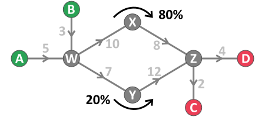

Conceptual Examples
====================

Path Finding Example
--------------------
Given a network as shown, what is the shortest (lowest cost) route between A and D?
The cost to travel on each link is shown as a number between the nodes.

.. image:: ../../tests/networks/net04/net04_example.png

There are two possible routes between A and D.

- A-W-**X**-Z-D: Total cost = 27
- A-W-**Y**-Z-D: Total cost = 28

For this network, Jodeln would automatically find the lowest-cost route via node **X**. 
The user can override Jodeln's path finding by importing their own set of one or more routes for each OD pair.

Path Finding Outputs
--------------------

Jodeln can output **4 csv files** related to the network and routes.
The following examples show the primary two csv files.
The elipsis in each example indicates that more rows would be included for other OD pairs beyond the example OD from A to D (i.e. the files would include A to C, B to D, etc).

An output **csv of links** lists each link (sequence of two nodes *a-b*) along a route from the origin to the destination.
Each row is a link along the route.
Each route is automatically assigned a unique name based on a unique link within the route.
The lowest-cost route between A and D goes through link W-X, and is therefore assigned the name **W_X** in the route column.

.. csv-table:: CSV of links (links along path A-D shown)
   :file: tables_conceptual_examples\example csv of links.csv

An output **csv of turns** lists each turn (sequence of 3 nodes *a-b-c*) along a route from the origin to the destination.

.. csv-table:: CSV of turns (turns along path A-D shown)
   :file: tables_conceptual_examples\example csv of turns.csv

How are Path Finding Outputs Helpful?
-------------------------------------

One way to use the csv outputs is for traffic assignment spreadsheets.
Consider the following example problem: ::

   Given the following OD volume matrix, find the volume on each network link.
   Origins are in the rows, destinations in the columns.

.. csv-table:: OD Volumes
   :file: tables_conceptual_examples\given od matrix.csv

This problem can be solved by importing the **csv of links** into a spreadsheet and adding an *OD volume* column to the table.
For each row, the *OD volume* column looks up the *o_node*-*d_node* pair within the OD matrix and returns the volume (each A-D row contains the volume 35, each A-C row contains 100, etc).

.. csv-table:: Volume Spreadsheet
   :file: tables_conceptual_examples\volume spreadsheet.csv

The volume on each link can be found by conditionally summing the *OD volume* column.
For example, the volume on link A-W can be found by summing the *OD volume* column for all rows where *a_node* = A and *b_node* = W.
The volume on link A-W = 135 (found by summing *OD volume* for rows 1 and 5, assuming none of the elipsis rows affect link A-W).

Volumes on turns within the network can be found by using similar logic to the above example.
Other uses for Jodeln outputs are left to the imagination of the user.

OD Matrix Estimation Example
----------------------------
In this example, Jodeln estimates an OD matrix based on user-inputs consisting of an initial (seed) matrix, link target volumes, and assumed route percentages.

*The network and link costs:*

.. image:: ../../tests/networks/net04/net04_link_costs.png

*Target volumes:*

.. image:: ../../tests/networks/net04/net04_target_volumes.png

*Routes:*

There is more than one route from each origin to each destination.
Jodeln only automatically finds the single shortest route.
If the user wants to include multiple routes (or override the shortest route), they must input the routes and assumed percentages manually.
Jodeln does not have any functions to estimate route percentages.
The OD matrix estimation will try to respect the assumed input route percentages, but may deviate in order to meet the target volumes.

In this example, there are two routes from each origin to each destination (Origins: A, B. Destinations: C, D.)
The user-assumed inputs are 80% of traffic using the route via node X, and 20% via node Y.

*Seed OD matrix of total traffic between each origin and destination:*

.. csv-table:: Seed Matrix
   :file: tables_conceptual_examples\seed matrix.csv

Outputs
^^^^^^^

Given the above inputs, the estimated OD matrix from Jodeln is shown below.
Because Jodeln uses an evolutionary stragegy (`CMA-ES <https://en.wikipedia.org/wiki/CMA-ES>`__) for estimating OD, the outputs may differ slightly each time you run the program.
Outputs from Jodeln are in csv format, and include the total traffic for each OD pair as well as the traffic assigned to each route.

.. csv-table:: Estimated Matrix
   :file: tables_conceptual_examples\output matrix.csv
